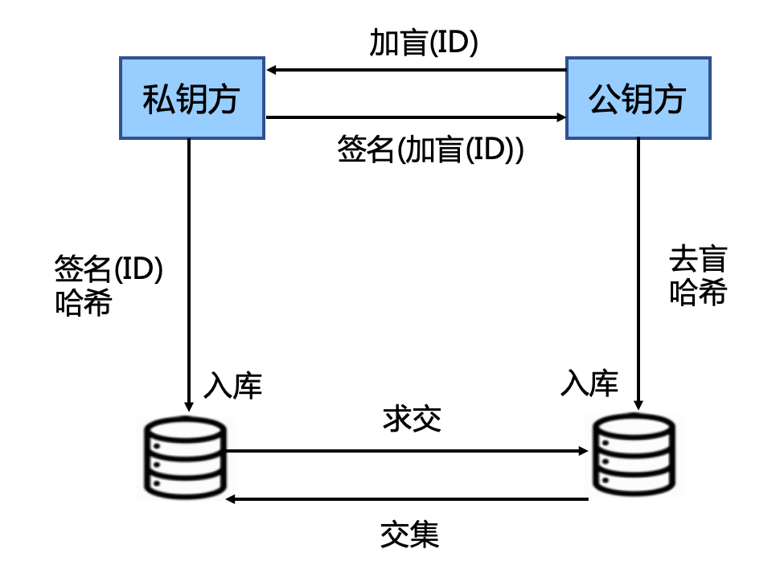

本项目中的 PSI 实现是基于 RSA blind signature 协议，该协议的算法介绍可以参考 [这篇文章](https://zhuanlan.zhihu.com/p/138557549)。

算法的流程如下图：

其中私钥方是持有 RSA 私钥 `(n, d)` 一方，公钥方只有 RSA 公钥 `(n, e)` 。双方约定好的 hash 函数表示为 `H`。

算法的各个步骤解释如下：

1.  加盲 ID：公钥方对于自己每个样本 ID_b，计算 `ID_b * r^e`，其中 `r` 是一个随机数，取值范围在 `0 <= r < n`，其中 `n` 是 RSA 加密算法中的取模数，`e` 是 RSA 中的公钥。然后发送给私钥方；
2.  加密(加盲(ID)) : 私钥方收到 `ID_b * r^e` 之后，对其做签名，即计算 `(ID_b * r^e)^d = (ID_b)^d * r`，将签名后的结果返回公钥方；
3.  去盲、哈希：公钥方收到 `(ID_b)^d * r` 之后，在本地计算 `(ID_b)^d * r * r^(-1) = (ID_b)^d`，其中 `r^(-1)` 表示随机数 `r` 在 `mod n` 情况下的逆，即 `r * r^(-1) mod n = 1 mod n`；私钥方接着计算 `H((ID_b)^d)` ，将结果保存在本地数据库中；
4.  哈希(加密(ID)) : 私钥方对自己的 ID_a，首先用自己的私钥做签名，得到 `(ID_a)^d`；接着在计算 `H((ID_a)^d)`，将该值发送给公钥方；
5.  公钥方在 hash 函数域上计算交集，并将交集的的结果映射回原始的 ID 空间，得到两个参与方之间的共同 ID；
6.  公钥方将 ID 交集返回给招行方，算法结束。